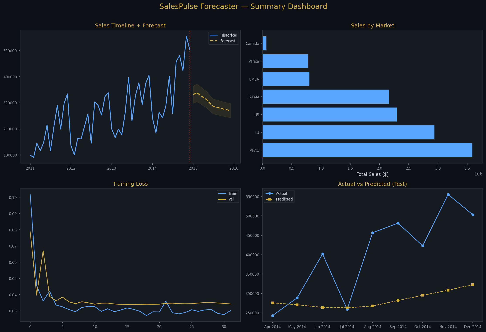
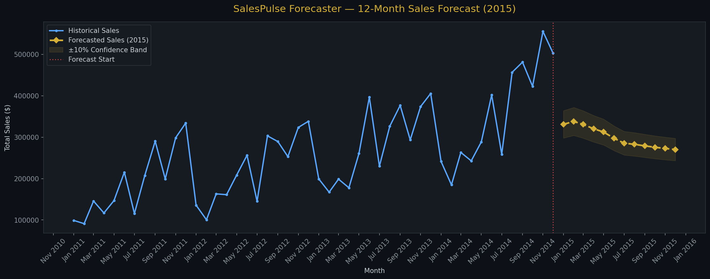
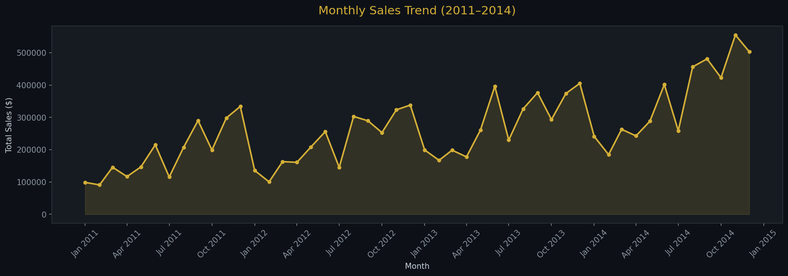
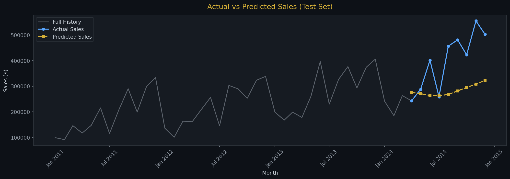

# 📈 SalesPulse Forecaster


> **LSTM-based time series forecasting on Global Superstore sales data (2011–2014). Predicts monthly sales 12 months ahead using a 2-layer LSTM with SQL-powered data analysis pipeline.**

---

## 🖼️ Dashboard Preview



---

## 📊 Model Performance

| Metric | Value |
|--------|-------|
| **MAE** | $126,231 |
| **RMSE** | $151,234 |
| **MAPE** | 27.66% |
| **Forecast Horizon** | 12 Months |
| **Total 12M Forecast** | $3,595,565 |

---

## 🔮 Forecast Results



| Month | Forecast |
|-------|---------|
| Peak Month | Feb 2015 — $337,994 |
| Low Month | Dec 2015 — $270,242 |
| Total (12M) | **$3,595,565** |

---

## 📌 Project Overview

| Item | Detail |
|------|--------|
| **Dataset** | Global Superstore 2011–2014 |
| **Records** | 51,290 transactions |
| **Features** | Order Date, Segment, Market, Sales, Profit |
| **Model** | 2-Layer LSTM (128 → 64 units) + Dropout |
| **Framework** | TensorFlow / Keras |
| **Data Layer** | SQLite + SQLAlchemy |
| **Look-back Window** | 6 months |
| **Forecast Horizon** | 12 months |

---

## 🗂️ Notebook Structure

| Phase | Section |
|-------|---------|
| 1 | Data Loading & SQL Analysis |
| 2 | Exploratory Data Analysis (EDA) |
| 3 | Data Preprocessing & Sequence Generation |
| 4 | LSTM Model Architecture |
| 5 | Training & Evaluation |
| 6 | 12-Month Sales Forecasting |
| 7 | Results & Business Insights |

---

## 📈 Charts Generated

| Chart | Description |
|-------|-------------|
|  | Monthly Sales Trend |
|  | Actual vs Predicted |

---

## 🧠 Model Architecture

```
Input → LSTM(128, return_sequences=True) → Dropout(0.2)
     → LSTM(64) → Dropout(0.2)
     → Dense(32, relu) → Dense(1)
Optimizer: Adam | Loss: MSE
Callbacks: EarlyStopping + ReduceLROnPlateau
```

---

## 📁 Project Structure

```
SalesPulse-Forecaster/
│
├── 📓 notebooks/
│   └── salespulse_forecaster.ipynb   ← Main notebook (fully executed)
│
├── 📊 data/
│   └── GlobalSuperstoreData.csv      ← Source dataset
│
├── 🖼️ assets/
│   ├── 01_monthly_sales_trend.png
│   ├── 02_sales_by_market.png
│   ├── 03_segment_analysis.png
│   ├── 04_yoy_growth.png
│   ├── 05_training_loss.png
│   ├── 06_actual_vs_predicted.png
│   ├── 07_12month_forecast.png
│   └── 08_summary_dashboard.png
│
├── 📄 requirements.txt
└── 📄 README.md
```

---

## 🚀 How to Run

```bash
# 1. Clone the repo
git clone https://github.com/venkatraman0400-blip/SalesPulse-Forecaster.git
cd SalesPulse-Forecaster

# 2. Install dependencies
pip install -r requirements.txt

# 3. Open the notebook
jupyter notebook notebooks/salespulse_forecaster.ipynb
```

---

## 🛠️ Tech Stack

| Tool | Purpose |
|------|---------|
| **TensorFlow / Keras** | LSTM model building & training |
| **SQLite + SQLAlchemy** | SQL-based data storage & queries |
| **Pandas / NumPy** | Data manipulation |
| **Scikit-Learn** | MinMaxScaler, evaluation metrics |
| **Matplotlib / Seaborn** | Visualisations |

---

## 👨‍💻 Author

**Venkatraman R** — Data Science & AI Engineer  
📍 Chennai, India | Boston Institute of Analytics, 2026

[](https://venkatraman0400-blip.github.io/venkatraman-portfolio)
[](https://linkedin.com/in/venkatraman0400)
[](https://github.com/venkatraman0400-blip)

---

*Part of my Data Science & AI portfolio — LSTM time series forecasting with SQL data pipeline.*
